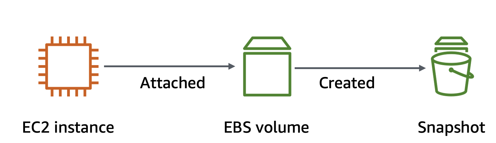
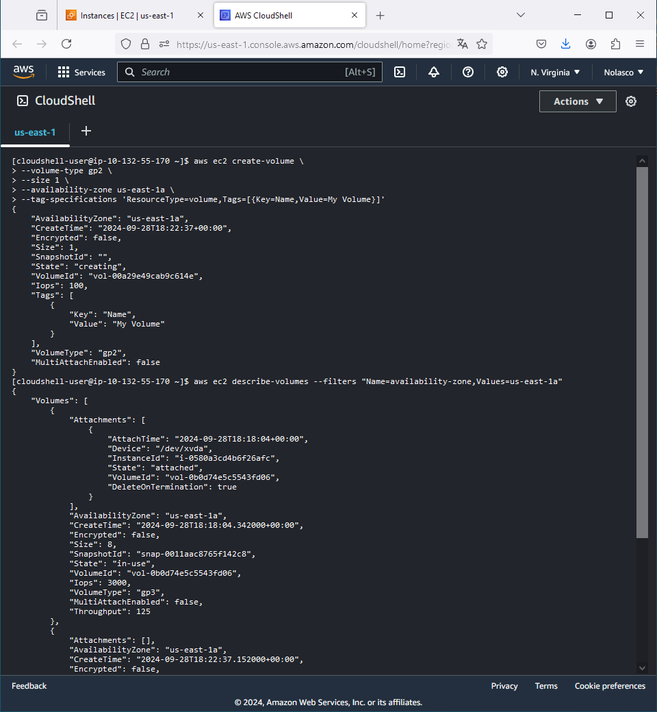
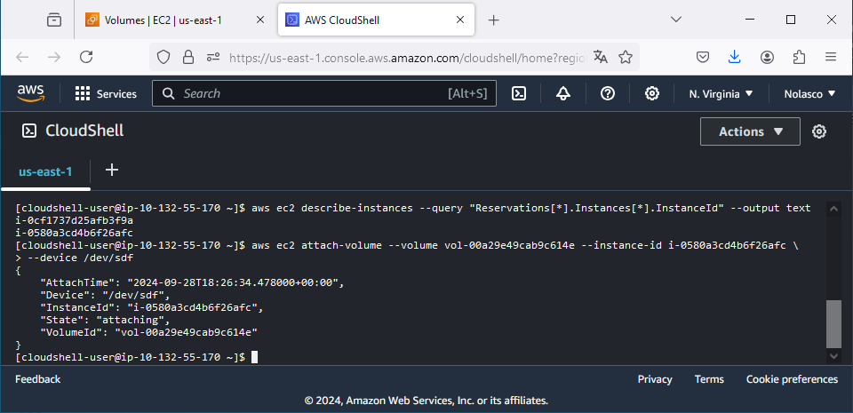
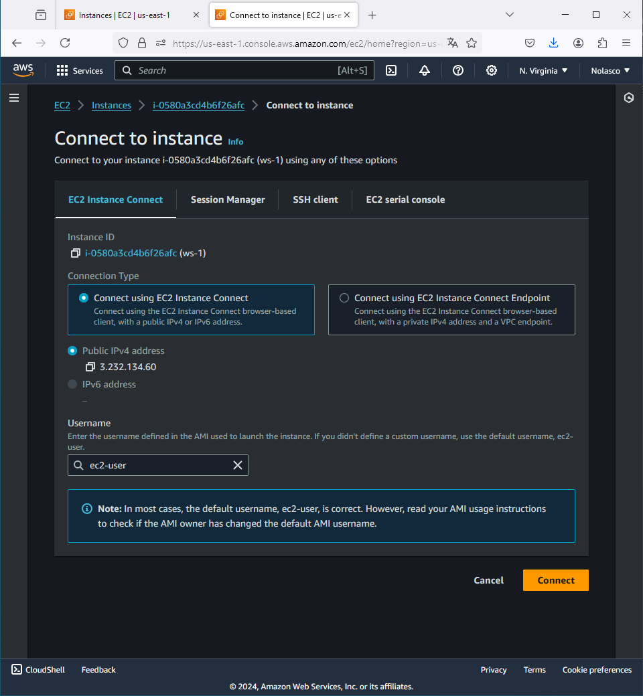
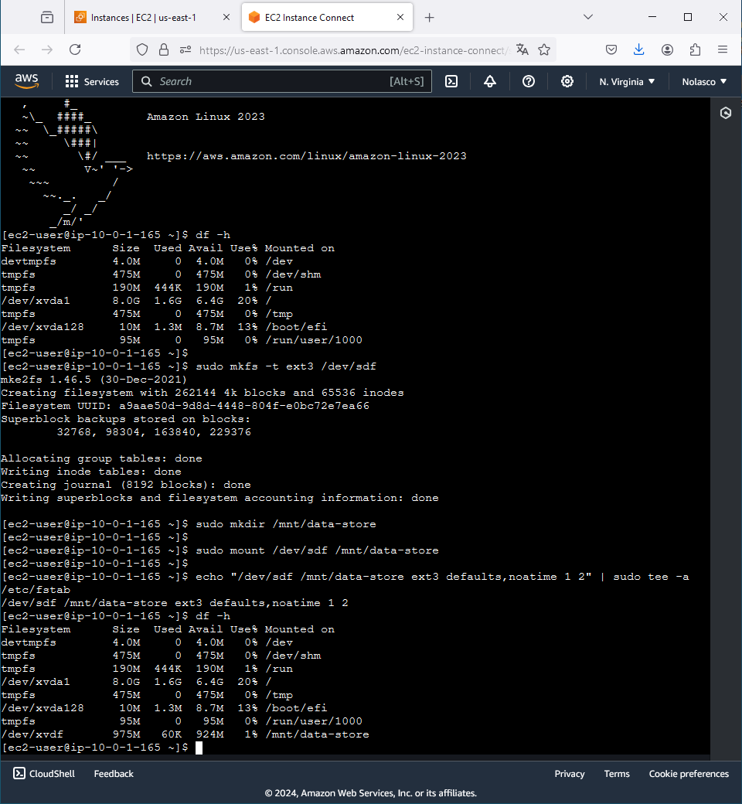
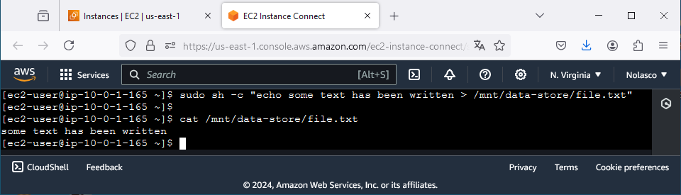
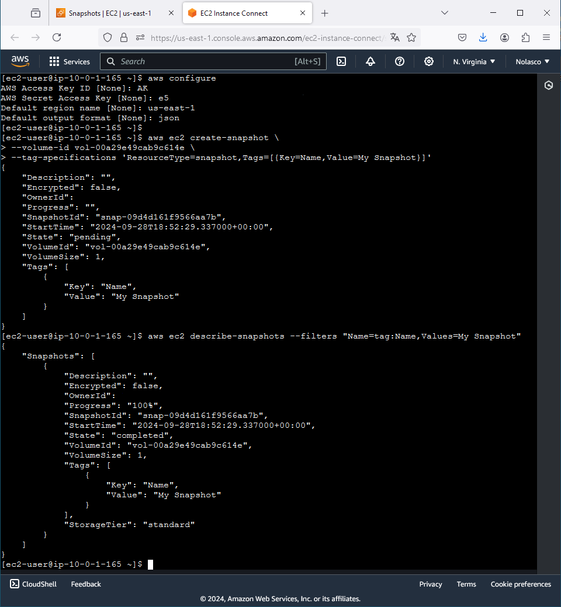
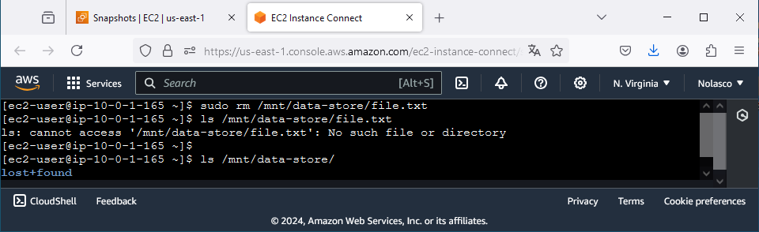
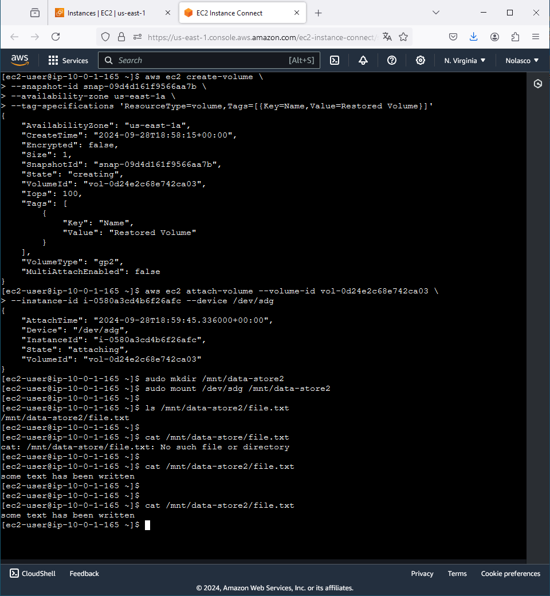

# AWS EBS Lab

<div align="center">
  
</div>

---
## Objectives
- Create an EBS volume.
- Attach and mount an EBS volume to an EC2 instance.
- Create a snapshot of an EBS volume.
- Create an EBS volume from a snapshot.
---

⚠️ **Attention**: 
- All the tasks will be completed via the command line using AWS CloudShell. Ensure you have the necessary permissions. [AWS CloudShell](https://docs.aws.amazon.com/pt_br/cloudshell/?id=docs_gateway)
- Charges may apply for completing this lab. [AWS Pricing](https://aws.amazon.com/pricing/)
- Assume you already have an EC2 instance running.

---

## Task 1: Creating a new EBS volume
  - A new EBS volume will be created to provide extra storage for the EC2 instance.
---
#### 1.1. Create the EBS volume:
```bash
aws ec2 create-volume \
  --volume-type gp2 \
  --size 1 \
  --availability-zone <your-availability-zone> \
  --tag-specifications 'ResourceType=volume,Tags=[{Key=Name,Value=My Volume}]'
```
#### 1.2. List your volumes to confirm creation:
```bash
aws ec2 describe-volumes --filters "Name=availability-zone,Values=<your-availability-zone>"
```

<div align="center">
  
</div>

---
## Task 2: Attaching the volume to an EC2 instance
  - The EBS volume will be attached to the EC2 instance, allowing it to be used for storage.
---
#### 2.1. Obtain the instance ID:
```bash
aws ec2 describe-instances --query "Reservations[*].Instances[*].InstanceId" --output text
```
#### 2.2. Attach the volume to the instance:
```bash
aws ec2 attach-volume --volume-id <volume-id> --instance-id <instance-id> --device /dev/sdf
```

<div align="center">
  
</div>

---
## Task 3: Connecting to the EC2 instance
  - Connect to the EC2 instance using **EC2 Instance Connect** to run commands and manage the EBS volume.
---

<div align="center">
  
</div>

---
## Task 4: Creating and configuring the file system
  - The EBS volume will be formatted and mounted so files can be stored on it.
---
#### 4.1. Check the available storage:
  - Displays the current disk usage in a human-readablle format (GB/MB).
```bash
df -h
```
#### 4.2. Create an ext3 file system on the new volume:
  - Formats the volume `/dev/sdf` with the ext3 file system.
```bash
sudo mkfs -t ext3 /dev/sdf
```
#### 4.3. Create a directory to mount the volume:
  - Creates a directory where the volume will be mounted.
```bash
sudo mkdir /mnt/data-store
```
#### 4.4. Mount the volume:
  - Mounts the volume `/dev/sdf` to the directory `/mnt/data-store`.
```bash
sudo mount /dev/sdf /mnt/data-store
```
#### 4.5. Add the volume to fstab for automatic mounting:
  - Configures the volume to automatically mount at startup.
```bash
echo "/dev/sdf   /mnt/data-store ext3 defaults,noatime 1 2" | sudo tee -a /etc/fstab
```
#### 4.6. Check if the volume is mounted:
  - Checks disk usage again to ensure the volume is mounted.
```bash
df -h
```

<div align="center">
  
</div>

#### 4.7. Create a file on the volume:
  - Creates a file and writes text inside the mounted volume.
```bash
sudo sh -c "echo some text has been written > /mnt/data-store/file.txt"
```
#### 4.8. Check the file content:
  - Displays the content of the file created on the volume.
```bash
cat /mnt/data-store/file.txt
```

<div align="center">
  
</div>

---
## Task 5: Creating an EBS snapshot
  - A snapshot of the EBS volume will be created to back up data for recovery.
---
#### 5.1. Create the snapshot:
```bash
aws ec2 create-snapshot \
  --volume-id <volume-id> \
  --tag-specifications 'ResourceType=snapshot,Tags=[{Key=Name,Value=My Snapshot}]'
```
#### 5.2. Check the snapshot status:
```bash
aws ec2 describe-snapshots --filters "Name=tag:Name,Values=My Snapshot"
```

<div align="center">
  
</div>

#### 5.3. Remove the file from the volume:
```bash
sudo rm /mnt/data-store/file.txt
```
#### 5.4. Verify that the file has been deleted:
```bash
ls /mnt/data-store/file.txt
```

<div align="center">
  
</div>

---
## Task 6: Restoring the snapshot to a new EBS volume
  - A new EBS volume will be created from the snapshot to restore any lost data.
---
#### 6.1. Create a new volume from the snapshot:
```bash
aws ec2 create-volume \
  --snapshot-id <snapshot-id> \
  --availability-zone <your-availability-zone> \
  --tag-specifications 'ResourceType=volume,Tags=[{Key=Name,Value=Restored Volume}]'
```
#### 6.2. Attach the restored volume to the EC2 instance:
```bash
aws ec2 attach-volume --volume-id <new-volume-id> --instance-id <instance-id> --device /dev/sdg
```
#### 6.3. Mount the restored volume:
```bash
sudo mkdir /mnt/data-store2
sudo mount /dev/sdg /mnt/data-store2
```
#### 6.4. Verify that the restored file exists:
```bash
ls /mnt/data-store2/file.txt
```

<div align="center">
  
</div>

---

## Conclusion
We can manage EBS volumes from an instance, create snapshots, and generate new volumes from those snapshots, all using AWS CloudShell through the browser in the AWS Management Console.
 to access the automated version with shell scripts.

